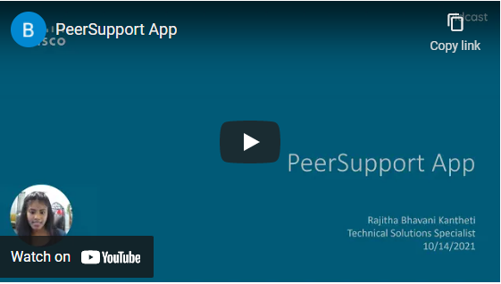
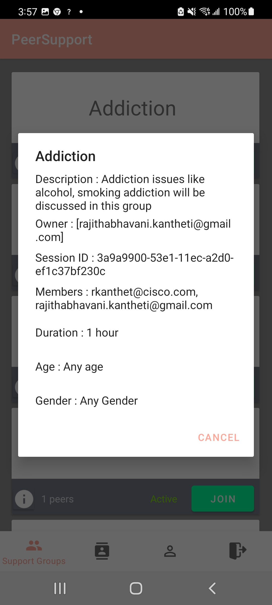
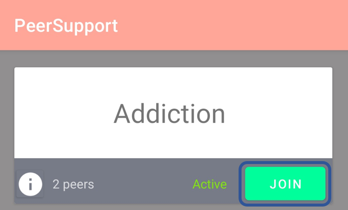
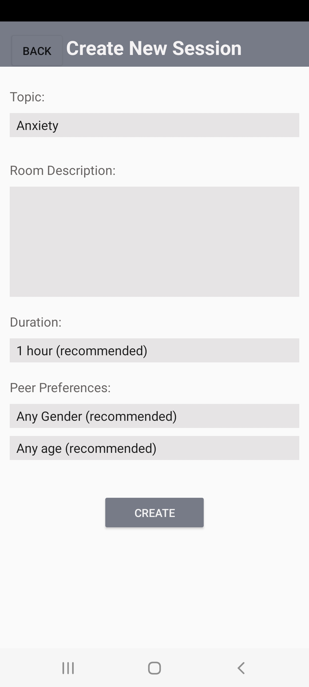
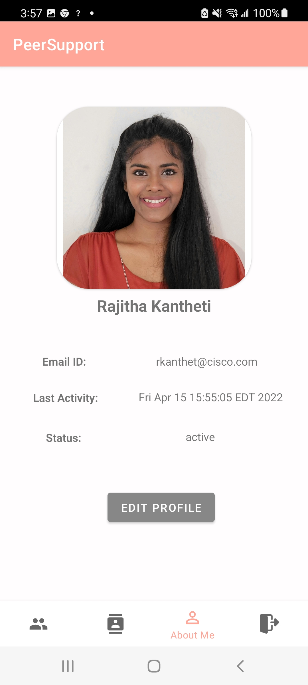
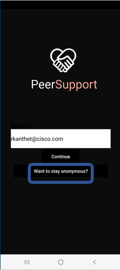

# Peer Support
Welcome to our WXSD DEMO Repo! <!-- Keep this here --> 

This is a sample application which demonstrates how a possible community-based peer-to-peer mental/health support platform could be created using Webex android SDK. We use the SDK to demonstarte functionalities like creating sessions, let the user join the sessions, get details of the members in the sessions, retrieve details of the user and soon. The target audience for this PoC are health care professionals who want an effortless way to group and meet thier clients. The app has a user-friendly interface, making it easy for users to find the right group to solve their problems.

<!-- Keep the following here -->  
 *_Everything included is for demo and Proof of Concept purposes only. Your use of the site is solely at your own risk. This site may contain links to third party content, which we do not warrant, endorse, or assume liability for. These demos are for Cisco Webex usecases, but are not Official Cisco Webex Branded demos._

## Table of Contents

- [Video Demo](#video-demo)
- [Overview](#overview)
- [Integration](#integration)
- [Functionality](#functionality)
  - [Support Groups](#support-groups)
    - [Info](#info)
    - [Members in a Group](#members-in-a-group)
    - [Join the space](#join-the-space)
  - [Contacts](#contacts)
    - [Create New Session](#create-new-session)
    - [View Join Requests](#view-join-requests)
  - [About Me](#about-me)
  - [Stay Anonymous](#stay-anonymous)
  - [Logout](#logout)
- [Contact](#contact)

## Video Demo

## Overview

In this application, the user can create new therapy sessions or join an existing session and start messages and meetings in the group using Webex android SDK. Here, the user can login using OAuth or as a guest user using JWT. We use SDK to create sessions, let the user join the sessions, get details of the members in the sessions, retrieve details of the user and soon. During the meeting the user can define various meeting options.

## Integration

1.  Add the following repository to your top-level `build.gradle` file:

        allprojects {
            repositories {
                maven {
                    url 'https://devhub.cisco.com/artifactory/webexsdk/'
                }
            }
        }

2.  Add the `webex-android-sdk` library as a dependency for your app in the `build.gradle` file:

        dependencies {
            implementation 'com.ciscowebex:androidsdk:3.2.0@aar'
        }

## Functionality

### Support Groups

The first page in the peer support app is the support groups page. In this all the support groups that are active/ closed are displayed and you can view the details of the support group.

#### Info

By clicking on the info icon on each support group, you can view the description, owner of the group, session ID, member emails, duration, gender or age preferneces of that group.

#### Members in a Group

You can view the number of members present in a group on the support group card. To view the mebers details like email address, press on the info icon.

#### Join the Space

Once you are ready and would like to join a space, you can click on the Join button and you are already not a member it turns to waiting and you have to wait till the owner of the space lets you in. But if you are a member you can directly join the space and start messaging and calling.

### Contacts

This is the second page in the peer support app. In this all the support groups you are a member of is shown. If you are the owner of a specific group then, view join request button is also shown.

#### Create New Session

You can click on the green create new session button on the top to create a space. On clicking you can enter the details like topic name, description, duration, and other peer preferences like gender and age.

#### View Join Requests

If you the owner of any support group, you will be able to see this button in this page. You can click on a specific group card to view and allow people into that space.

### About Me

Next page in the peer support app is the about me page. In this page you can view your details like avatar, email ID, last activity and status. You cn also edit your information like gender and age details. This is always optional.

### Stay Anonymous

If you wish to stay anonymous, while logging in just click on the stay anonymous button and you will be logged in as a guest user. Your details wont be displayed to anyone.

### Logout

Once you are done exploring the application please click on the logout button to securely logout.

## Contact

Please contact us at wxsd@external.cisco.com
